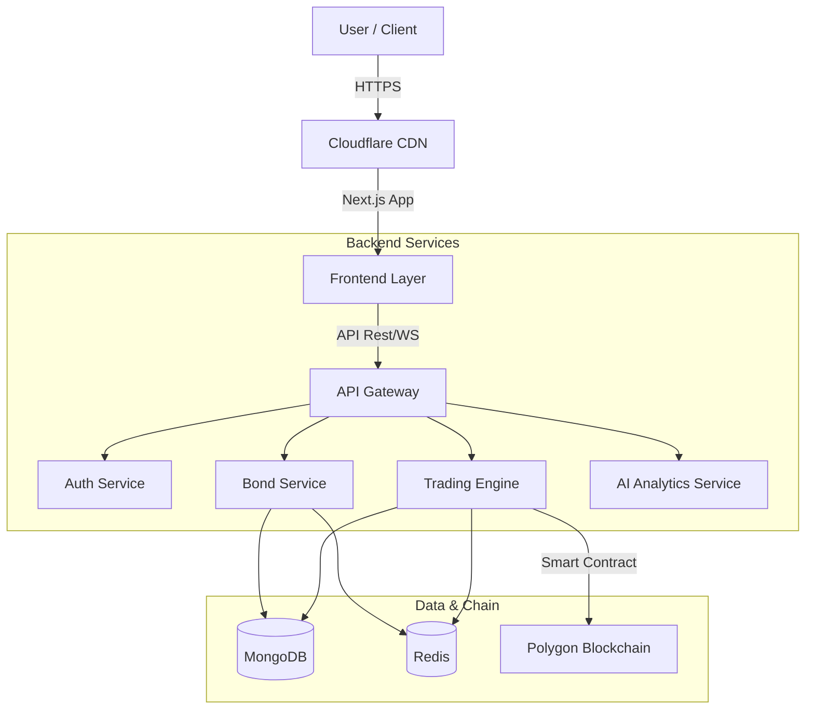

<div align="center">

  # Infrastructure Bond Tokenization Platform
  ### CIH3.0: Central India Hackathon | SDG 9.12

  **Transforming Public Infrastructure Funding through Blockchain & AI**

  [](https://nextjs.org/)
  [](https://nodejs.org/)
  [](https://www.mongodb.com/)
  [](https://www.docker.com/)
  [](https://polygon.technology/)

  <p align="center">
    <a href="#key-features">Features</a> •
    <a href="#getting-started">Getting Started</a> •
    <a href="#architecture">Architecture</a> •
    <a href="#api-documentation">API</a>
  </p>
</div>

---

## 
**"Create a platform for tokenizing infrastructure bonds to enable public-private funding."**

We address the critical gap in infrastructure financing by democratizing access to high-value assets. Our platform allows retail investors to legally own fractional shares of roads, bridges, and energy projects, fostering economic growth and innovation strictly aligned with **UN Sustainable Development Goal 9**.

---

## 

### For Investors
- **Fractional Ownership**: Buy & sell tokenized bonds starting from ₹500.
- **AI-Powered Insights**:
  - **Risk Assessment**: Real-time 0-100 risk score.
  - **Return Prediction**: LSTM-based forecasts for informed decisions.
- **e-Rupee Integration**: Seamless payments via CBDC (Digital Rupee).
- **Paper Trading**: Practice with ₹10 Lakh virtual portfolio before investing.

### For Issuers & Platform
- **Smart Contract Settlement**: Instant, trustless settlements on the Polygon network.
- **Regulatory Compliance**: Automated KYC (Aadhaar/DigiLocker) & SEBI reporting.
- **Real-time Transparency**: Immutable ledger records for every transaction.

---

## 

| Domain | Technologies |
| :--- | :--- |
| **Frontend** | Next.js 14, Tailwind CSS, Shadcn UI, Framer Motion |
| **Backend** | Node.js, Express.js, Socket.io (Real-time) |
| **Database** | MongoDB (Data), Redis (Caching) |
| **Blockchain** | Solidity, Hardhat, Ethers.js, Polygon Mumbai |
| **AI / ML** | Python microservices (LSTM, Random Forest) |
| **DevOps** | Docker, Nginx, GitHub Actions |

---

## 

Our solution utilizes an **Event-Driven Microservices Architecture** to ensure detailed scalability and reliability.



---

## 

### Prerequisites
- **Node.js** v18+ (verified with v24.11.1)
- **MongoDB** v6.0+ (running locally or MongoDB Atlas)
- **npm** for package management

### Installation & Running

1. **Clone the Repository**
   ```bash
   git clone https://github.com/Pusparaj99op/CIH3.0-SDG9.12.git
   cd CIH3.0-SDG9.12
   ```

2. **Install Dependencies**
   ```bash
   # Frontend dependencies
   cd frontend && npm install

   # Backend dependencies
   cd ../backend && npm install
   ```

3. **Start MongoDB Service**
   ```bash
   # On Linux/Ubuntu
   sudo systemctl start mongod
   sudo systemctl status mongod

   # For other systems, ensure MongoDB is running on mongodb://localhost:27017
   ```

4. **Configure Environment**
   Backend environment is pre-configured in `backend/.env`:
   ```env
   PORT=3210
   NODE_ENV=development
   MONGODB_URI=mongodb://localhost:27017/mudra
   JWT_SECRET=your-super-secret-jwt-key-change-in-production
   JWT_EXPIRE=7d
   ```

5. **Launch Backend Server**
   ```bash
   cd backend
   npm start
   ```
   ✅ Backend runs on: **`http://localhost:3210`**

6. **Launch Frontend Application**
   ```bash
   # In a new terminal
   cd frontend
   npm run dev
   ```
   ✅ Frontend runs on: **`http://localhost:5001`**

### Quick Test

Verify the platform is working:

```bash
# Test backend health
curl http://localhost:3210/api/health

# List all bonds
curl http://localhost:3210/api/bonds
```

Then visit [http://localhost:5001](http://localhost:5001) in your browser!

---

## 

### Core Endpoints (Verified & Working)

| Method | Endpoint | Description | Status |
| :--- | :--- | :--- | :---: |
| `GET` | `/api/health` | Backend health check | ✅ |
| `GET` | `/api/bonds` | List all infrastructure bonds | ✅ |
| `GET` | `/api/bonds/:id` | Get specific bond details | ✅ |
| `POST` | `/api/auth/register` | User registration with paper trading | ✅ |
| `POST` | `/api/auth/login` | User authentication | ✅ |
| `GET` | `/api/portfolio` | Fetch user holdings & PnL | ✅ |
| `POST` | `/api/paper-trading/buy` | Execute paper trading buy order | ✅ |
| `POST` | `/api/paper-trading/sell` | Execute paper trading sell order | ✅ |
| `GET` | `/api/transactions` | View transaction history | ✅ |

### Sample Response - Bonds API

```json
{
  "success": true,
  "count": 10,
  "source": "mongodb",
  "data": [
    {
      "_id": "697ca547049befc0b476830c",
      "name": "National Highway Infrastructure Bond",
      "issuer": "NHAI",
      "returnRate": 7.5,
      "riskLevel": "Low",
      "price": 10000,
      "maturityYears": 5,
      "sector": "Transportation",
      "totalValue": 50000000000,
      "availableUnits": 2500000,
      "isActive": true
    }
  ]
}
```

---

## 

### Current Application Status ✅

The platform is **fully functional** with the following verified features:

#### 🎨 Frontend Features
- **Modern UI/UX**: Beautiful gradient-based design with purple-blue theme
- **Bond Discovery**: Search, filter (by risk, sector, return rate), and sort capabilities
- **Detailed Bond View**: Comprehensive bond information with AI risk assessment
- **Paper Trading**: Virtual ₹10,00,000 balance for risk-free practice
- **Authentication**: User registration and login system
- **Real-time Backend Connection**: Live data from MongoDB

#### 🔧 Backend Features
- **RESTful API**: Full CRUD operations for bonds, users, and transactions
- **MongoDB Integration**: 10+ pre-seeded infrastructure bonds
- **Authentication System**: JWT-based secure authentication
- **Paper Trading Engine**: Virtual trading without real money
- **Portfolio Management**: Track holdings and profit/loss

#### 📊 Available Bonds (Live Data)

1. **National Highway Infrastructure Bond** - NHAI (7.5% return, Low risk)
2. **Metro Rail Development Bond** - DMRC (8.2% return, Low risk)
3. **Green Energy Infrastructure Bond** - IREDA (9% return, Medium risk)
4. **Smart City Development Bond** - Smart City SPV (8.8% return, Medium risk)
5. **Port & Logistics Bond** - Sagarmala SPV (9.5% return, High risk)
6. **Rural Connectivity Bond** - PMGSY (7.8% return, Low risk)
7. **Water Infrastructure Bond** - Jal Jeevan Mission (8.5% return, Medium risk)
8. **Airport Modernization Bond** - AAI (9.2% return, Medium risk)
9. **Railway Infrastructure Bond** - Indian Railways (8% return, Low risk)
10. **Industrial Corridor Bond** - NICDIT (10% return, High risk)

---

## 

- [x] **Phase 0**: Project Setup & Architecture (✅ Completed)
- [x] **Phase 1**: Core Platform & MongoDB Integration (✅ Completed)
- [x] **Phase 2**: Frontend UI & Paper Trading (✅ Completed for CIH3.0 MVP)
- [ ] **Phase 3**: Blockchain Integration (Polygon Mumbai testnet)
- [ ] **Phase 4**: AI/ML Risk Assessment & Predictions
- [ ] **Phase 5**: Mobile App (React Native) & Secondary Market
- [ ] **Phase 6**: Institutional Dashboard & Cross-chain Bridge

---

## 

| Role | Name | Link |
| :--- | :--- | :--- |
|  | **Pranay Gajbhiye** | [](https://www.linkedin.com/in/pranaygajbhiye/) |
|  | **Abhijit Dohe** | |
|  | **Vineet Mandhalkar** | [](https://www.linkedin.com/in/vineet-ravi-mandhalkar-5a96a5334/) |
|  | **Samiksha Gupta** | [](https://www.linkedin.com/in/samiksha-gupta-042059335/) |


---

<div align="center">
  <sub>Built with ❤️ for <b>Central India Hackathon 3.0</b></sub>
</div>
